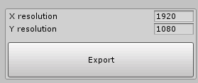

# ShaderExporter

Editor tool to export images from fully procedural pixel shaders in Unity.

Custom ShaderGUIs (shader inspectors) expose the target material property, which can be used to process anything.
This script passes an empty texture with XY size and blits it with the target.

You can adapt this so that instead of blitting an empty texture it blits one you give it.

Adapted from my 'Fractal-Megacollection' repository. It was a lifesaver for exporting fractal renderings without losing resolution.

# Contains

## ShaderExporter.cs

Contains the Texture Exporting code.

	1. Gets Path to save to
	2. Creates RenderTexture with XY size
	3. Blits Material to RT
	4. Convers RT to Texture2D
	5. Writes Texture2D to file

## ExampleEditor.cs

Contains a custom ShaderGUI that demonstrates how to use the ShaderExporter.

